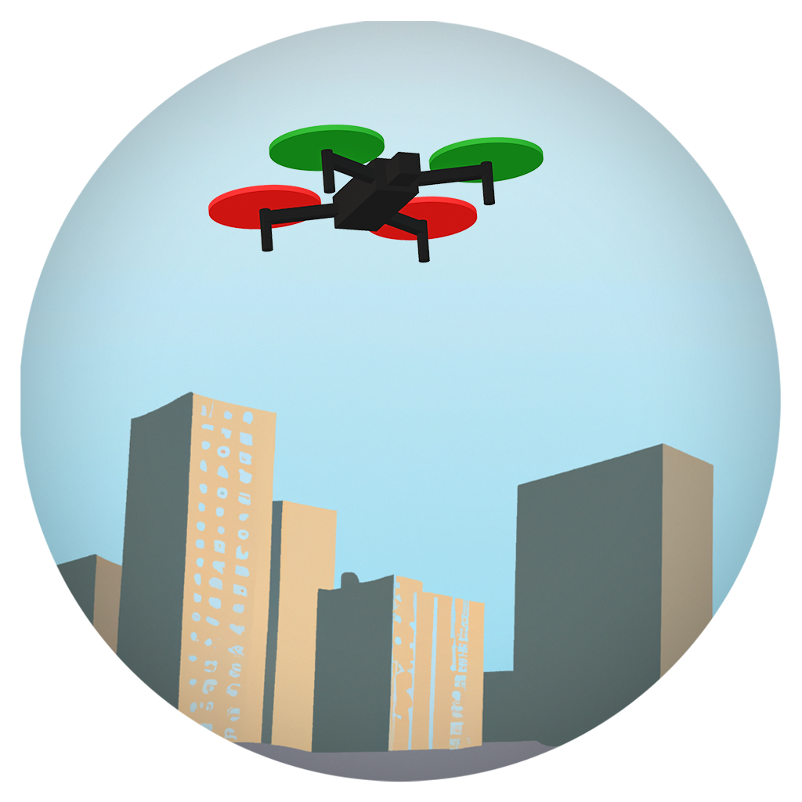

<!-- # U-TRAFMAN: Unmmaned Traffic Management Simulator -->

    
    <h1 align="center" style="text-align: center;">U-TRAFMAN: Unmmaned Traffic Management Simulator</h1>

**[Documentation](https://i3a-navsys.github.io/utrafman_sim/)**
 
---

## Welcome to U-TRAFMAN
U-TRAFMAN is a simulator designed for Urban Air Mobility (UAM) applications. Specifically, it is well-suited for the development of software tools and services related to Unmanned Aerial Vehicle Traffic Management (UTM).

## Features
- **Develop and test UAV autonomous control software and service implementations:** The control systems of Unmanned Aerial Vehicles (UAVs) can be modified, re-implemented, or extended.
- **Develop and verify UTM services:** Services and frameworks can be developed and tested to validate their feasibility. Information exchange between aircraft and services can occur through topics, and data can be stored and analyzed post-simulation for debugging. These services can be implemented on any platform compatible with ROS.
- **Provide realistic dynamic simulations of hundreds of UAVs within an urban area:** Thanks to the physics engine of the Gazebo simulator and its capabilities, UAV behaviors can be accurately modeled, making the simulations closely resemble real-world scenarios.

## Install
You can refer to the installation guide in the [documentation](https://i3a-navsys.github.io/utrafman_sim/#/install) for detailed instructions on how to install U-TRAFMAN.

## Contributors

- Rafael Casado - rafael.casado (at) uclm.es
- Aurelio Bermúdez - aurelio.bermudez (at) uclm.es
- Jesús Jover - jesus.jover (at) uclm.es

Please feel free to contribute to this project. If you encounter any bugs or wish to propose new features, please open an issue. If you want to contribute with code, consider opening a pull request to collaborate on the development.

## How to Cite
To cite U-TRAFMAN in your research or work, you can use the following citation format:
**U-TRAFMAN: Unmanned Traffic Management Simulator,** University of Castilla-La Mancha (Spain), 2023. Available at GitHub repository: [https://github.com/I3A-NavSys/utrafman_sim](https://github.com/I3A-NavSys/utrafman_sim).

## License
This project is licensed under the GNU GPL v3 license. For more details, please refer to the [LICENSE](LICENSE) file.

U-TRAFMAN is developed by the Navigation Systems team at the [High-Performance Networks and Architectures group](https://www.i3a.uclm.es/raap/) within the [University of Castilla-La Mancha](https://www.uclm.es/).

