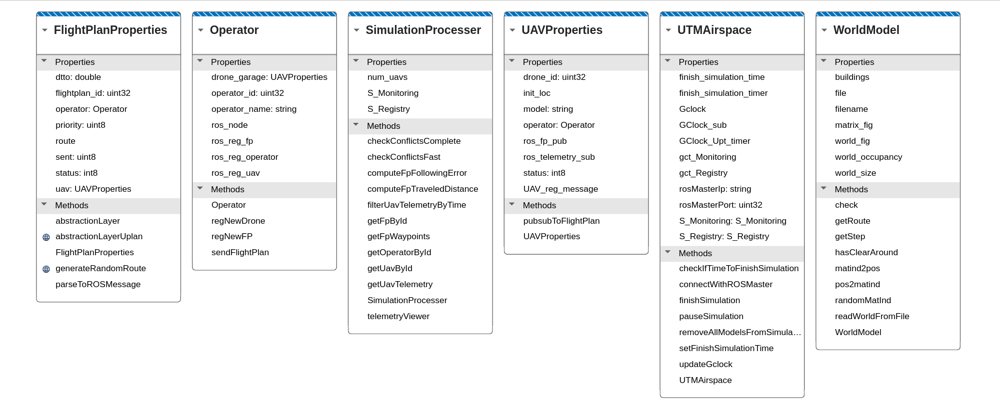

# MATLAB API

The MATLAB component in the repository is structured as follows:

## Classes

In MATLAB, you can utilize the `doc` command to access detailed documentation for each class. Below is a brief overview of each class:

- **classes/UTMAirspace.m**: This class serves as a representation of a UTM airspace. It includes details about the services (referred to as `S_*`), the simulation time (Gclock), and information for locating the ROS master. The class also provides methods to establish connections to the ROS network, update simulation time, and store simulation-related data.
- **classes/WorldModel.m**: This class is responsible for representing the world model using an occupancy matrix. It offers methods for reading the world definition in `.wc` format, checking the occupancy status of a specific position in the world, and generating random paths based on a desired distance.
- **classes/Operator**: The Operator class represents the owner of an aircraft and is responsible for scheduling flights. Each operator has a unique identifier and can manage multiple aircraft. The class includes methods for registering new UAVs, creating new flight plans, and dispatching flight plans to UAVs for execution. To facilitate communication with the aircraft, each operator is associated with a node registered in the ROS network.
- **classes/UAVProperties**: This class is designed to represent the properties of a UAV. It stores essential information, including a unique identifier, the aircraft model, the operator to whom it belongs, the initial location, and its current status.
- **classes/FlightPlanProperties**: This class is utilized to represent the properties of a flight plan. A flight plan comprises a series of 4D waypoints (denoted as _route_), which define the specific coordinates through which the UAV must navigate within a specified timeframe.
- **classes/SimulationProcesser**: This specialized class is responsible for processing and analyzing simulation data once the simulation has concluded. It performs the conversion of ROS messages stored in the Registry and Monitoring service (refer to the [UTM services documentation](./utm_services.md)) into MATLAB arrays. MATLAB processes these arrays more efficiently. After processing the data (typically by calling the constructor method with the UTMAirspace object), the class provides methods for retrieving, filtering, and computing information from the simulation data. Additionally, it offers various methods for data analysis and visualization, including conflict checkers and a telemetry viewer. The _SimulationProcesser_ object can be saved in a _.mat_ file, allowing for later retrieval and continuation of the analysis.

- **config/ros.m**: This file is used to configure ROS network information for MATLAB.

- **simulations/simple_simulation.m**: This script represents the simplest simulation scenario. It allocates a specified number of UAVs, each of which executes a flight plan covering a distance of 500 meters within the 'generated_city' world.

- **simulations/longterm_simulation.m**: This script implements a long-term simulation in which a predefined number of UAVs are allocated. In each simulation round, each UAV receives a flight plan within the 'generated_city' world. The total number of simulation rounds is determined by the defined total time and route distances.

- **tools/ros_custom_message_compiler_MATLAB.m**: This script contains the necessary code to compile ROS custom-defined messages for use in MATLAB.

This diagram shows the MATLAB classes defined in the U-TRAFMAN simulator:

