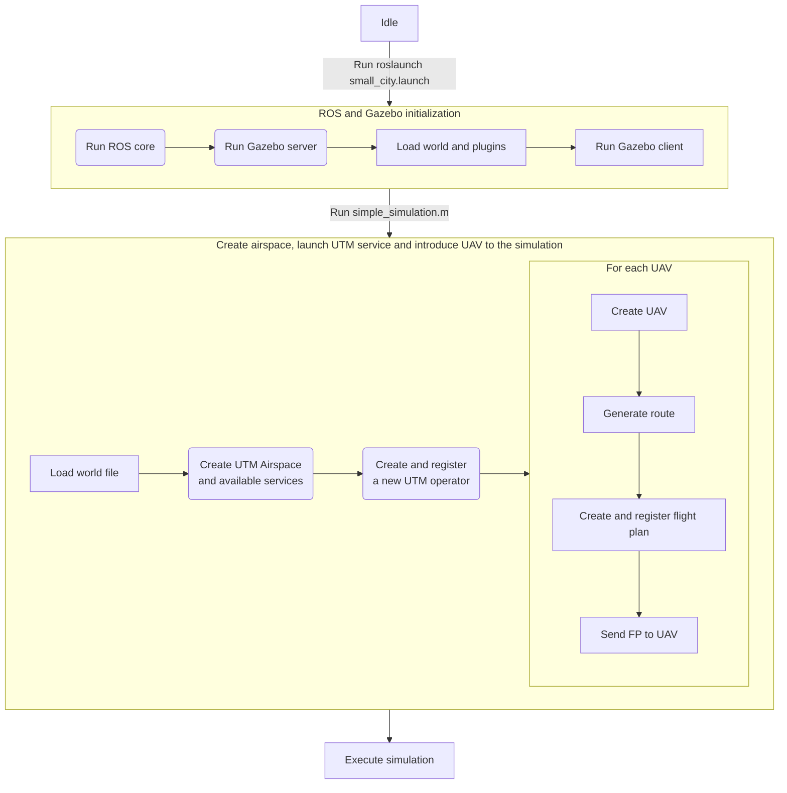

# 5. Tutorials
This section contains tutorials to install and use U-TRAFMAN Simulator.

## 5.1. Setup
As you discover in the previous section, U-TRAFMAN Simulator uses ROS, Gazebo and MATLAB. ROS and Gazebo must be installed on the same computer, but MATLAB could work on a different computer. This is because, in very large simulations, the resources of typical machines may not be enough. By dividing the load into two independent machines, larger simulations can be performed.

If you use a two-computer setup, both of them must be connected to the same network and be able to communicate with each other. If you want to avoid ROS network problems, you can use the same computer for ROS, Gazebo and MATLAB. 

#### Setting up ROS_MASTER IP address in MATLAB
Either way, MATLAB must be configured with ROS_MASTER IP address, as explained in [this tutorial](https://es.mathworks.com/help/ros/ug/get-started-with-ros.html). If you use a two-computer setup, you must configure MATLAB with the IP address of the computer where ROS is running, in the file `/src/matlab/config/ros.m`. If you use a one-computer setup, you can simply use `localhost` as ROS_MASTER IP address.


## 5.2. Installation
### ROS and Gazebo
>:warning:  U-TRAFMAN Simulator is only tested in **Ubuntu 20.04 and ROS Noetic**. Maybe it could work in other versions, but it is not guaranteed.

To install U-TRAFMAN Simulator, you need to install first ROS and Gazebo. You can follow the official tutorials to install ROS and Gazebo [here](http://wiki.ros.org/noetic/Installation). Once your Gazebo and ROS installation is complete, you can install U-TRAFMAN Simulator. **Remember to define the ROS environment variables, as explained in the ROS installation tutorial!**.

To install U-TRAFMAN Simulator, you need to clone the repository in your ROS installation. To do that, you can use the following command:

```bash
cd /opt/ros/noetic/share
git clone https://github.com/I3A-NavSys/utrafman_sim
```
> :warning:  Depending on your `share` folder permissions, you may need to use `sudo` to clone the repository and change the `utrafman_sim` folder permissions and/or owner after cloning.

You could install the simulator in other locations, but additional steps are needed. As you could see, `src/gazebo-ros/` is a ROS (_catkin_) workspace and contains all the simulation environment. On the other hand, `src/matlab/` includes simulator launch code, tools and telemetry viewer. Once you have cloned the repository, you need to compile the code. To do that, you can use the following commands:

```bash
cd /utrafman-sim/src/gazebo-ros #(or just cd utrafman_sim)
catkin_make
```
>:warning:  _catkin\_make_ will not work if you have not sourced ROS `/opt/ros/noetic/setub.bash` file. Add the source in your `.bashrc` or source it in the terminal before compiling the workspace!

Once the workspace is compiled, you also need to source the workspace into your `.bashrc` file. To do that, include the following line in your `.bashrc` file:

```bash
source /opt/ros/noetic/share/utrafman_sim/devel/setup.bash
```

Now you should be ready to run simulations.

### MATLAB

>:warning:  U-TRAFMAN Simulator is only tested with **MATLAB R2022a and newer versions, and Python 3.8**. Maybe it could work in other versions, but it is not guaranteed.

To install MATLAB, you can follow the official tutorial [here](https://es.mathworks.com/help/install/ug/install-mathworks-software.html).

#### Dependences
> :exclamation: This dependences are mandatory and needed to run the simulator.

 Once you have installed MATLAB, install all dependences:
- ROS Toolbox for MATLAB by MathWorks.
- Parallel Computing Toolbox for MATLAB by MathWorks.
- PLOTCUBE for MATLAB by Olivier (installed after MATLAB installation).
- Python3.x-venv (installed thougt terminal using apt install python3.x-venv).


#### Compiling ROS messages using MATLAB
Finally, as custom ROS messages are used, you need to compile them in order to be used in MATLAB. Use script file `/src/matlab/tools/ros-custom-message-compiler.m` to compile them. Edit the file to define where the working directory (repo) and python is installed on your computer and run the script. If everything is correct, you should see a message in the MATLAB console saying `Build succeeded`.

You could find more information about how to compile custom ROS messages [here](https://es.mathworks.com/help/ros/custom-message-support.html?s_tid=CRUX_lftnav). Once you have done all previous steps, you are ready to run simulations.

## 5.3. Running a simple simulation
### Simulation lifecycle
After run a simulation, you should understand how the simulation lifecycle works. The following diagram shows the lifecycle of a simulation: (**if the diagram is not shown, please reload the page (F5)).**

The simulation lifecycle is divided into three phases:
1. **ROS and Gazebo initialization**: In this phase, ROS and Gazebo are initialized. ROS core is launched, Gazebo server is launched and the world file is loaded. Finally, Gazebo client is launched and connected to the server. This phase is executed when you run the `roslaunch` command.
2. **Create airspace, launch UTM service and introduce UAV to the simulation**: In this phase, the UTM Airspace is created and the UTM services are launched. Then, a new operator is created and registered in the UTM Airspace. Finally, for each UAV, a new UAV is created, a random route is generated, a new flight plan is created and registered in the UTM Airspace, and the flight plan is sent to the UAV. **Note that this is usually the main sequence, but you can create and register operators, UAVs and flight plans at any time during the simulation.**. This phase is executed when you run the `%simulation%.m` script.

### Running your first simulation
U-TRAFMAN Sim comes with a simple simulation to test if ROS, Gazebo and MATLAB are working properly. Open MATLAB with `/src/matlab/` as current directory and, in a new terminal, run the following command:
```bash
roslaunch utrafman_main generated_city.launch
```
You should see how ROS is launched in the terminal, and Gazebo is launched in a new window. In the Gazebo window, you should see a world with simples buildings placed on it.


Now is the time to add some UAVs to the world and send flight plans to them. To do that, you must run in MATLAB the following script: `/src/matlab/simulations/simple_simulation.m`. This script will connect with ROS master from MATLAB, load the world definition file in MATLAB, create a single operator, create 10 UAVs and register both using the Registry service. Using the world definition file, the script will generate a flight plan for each UAV with a random route of 500 meters. Finally, the script will send the flight plans to the UAVs. 


Every time a random route is generated for a UAV, the script will print the route in a 3D figure showing the route and the buildings in the world.


Once the simulation has finised, an _SimulationProcesser_ object which variable name is `SP` will be available in the MATLAB workspace, allowing you to get and analyze the data. For example, if you want to visualize the telemetry data of a flight plan, you can run the following command in MATLAB:
```matlab
    SP.telemetryViewer(fp_id);
```

