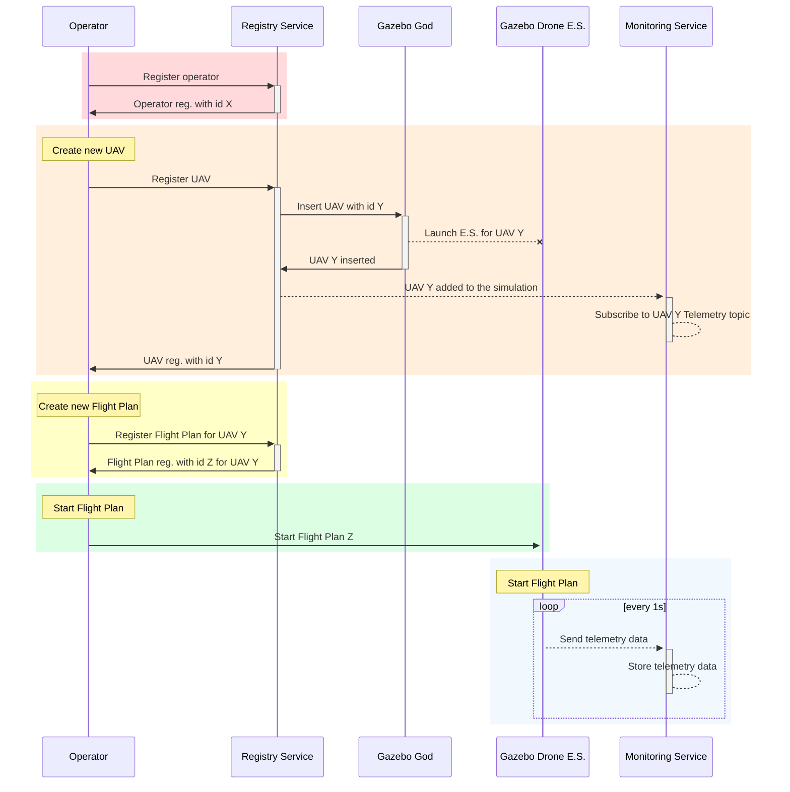

# UTM Services
Unmanned Traffic Management (UTM) is an emerging technology that will be used to manage the increasing number of unmanned aerial vehicles (UAVs) in the airspace. UTM will enable UAVs' safe, efficient, and secure integration into the existing air traffic management system. The UTM system will facilitate the safe exchange of information between UAVs, pilots, and other airspace users to ensure that UAVs operate safely and securely. To achieve that, UTM will offer "_services_", which are information exchange systems provided by different service providers, such as governments, private companies, etc. 

Some of these services are:
- Airspace authorization.
- Airspace management.
- Flight coordination.
- Real-time traffic information.
- Weather information.
- Conflict detection and resolution.
- etc.

As UTM technology advances, its services will become more reliable, secure, and efficient, enabling the safe integration of UAVs into the airspace. But nowadays, UTM is still in its infancy, and few services are available. Services in development must be tested, and this is where the U-TRAFMAN Simulator comes in. U-TRAFMAN Simulator is a flexible simulator that allows developing and testing for UTM services. These services could be implemented in MATLAB, as it is a widely-used language in the aerospace industry and a primary language in this project, but **you can use any other language if you want**.
<!-- In this 1.0 version, U-TRAFMAN does not offers any UTM service. It just offer a way to implement them. However, in the next versions, some UTM services will be implemented.  -->

## UTM Services in U-TRAFMAN Simulator
UTM Services inside the U-TRAFMAN Simulator are implemented using MATLAB. The communication between services is done using ROS Topics and Services, and it allows the services to be implemented in any language that supports ROS.

### Registry Service
The implementation of this service can be found in [S_Registry.m](https://github.com/I3A-NavSys/utrafman_sim/blob/main/src/matlab/classes/S_Registry.m). Registry Service maintains the information of entities in the airspace. It is a central service that allows other services to access the data of entities contained in the airspace. Every time an operator, UAV, or Flight Plan is created, it is registered in the Registry Service. The registry service offers each one a unique ID, which is used to identify it.

The topics and services offered by the Registry Service are:

<table>
    <thead>
        <tr>
            <th>Topic</th>
            <th>Type</th>
            <th>ROS Message</th>
            <th>Description</th>
        </tr>
    </thead>
    <tr>
        <td>/service/registry/reg_new_operator</td>
        <td>Service</td>
        <td>utrafman_main/reg_new_operator</td>
        <td>Used to register a new operator</td>
    </tr>
    <tr>
        <td>/service/registry/reg_new_uav</td>
        <td>Service</td>
        <td>/service/registry/reg_new_uav</td>
        <td>Used to register a new UAV</td>
    </tr>
    <tr>
        <td>/service/registry/reg_new_fp</td>
        <td>Service</td>
        <td>utrafman_main/reg_new_flightplan</td>
        <td>Used to register a new FlightPlan</td>
    </tr>
    <tr>
        <td>/service/registry/get_operators</td>
        <td>Service</td>
        <td>utrafman_main/reg_get_operators</td>
        <td>Used to get a list of operators. If an operatorId is specified, the requested only retrieves information about this operator</td>
    </tr>
    <tr>
        <td>/service/registry/get_uavs</td>
        <td>Service</td>
        <td>utrafman_main/reg_get_uavs</td>
        <td>Used to get a list of UAVs. If an uavId is specified, the requested only retrieves information about this UAV</td>
    </tr>
    <tr>
        <td>/service/registry/get_fps</td>
        <td>Service</td>
        <td>utrafman_main/reg_get_fps</td>
        <td>Used to get a list of Flight Plans. If an fpId is specified, the requested only retrieves information about this Flight Plan</td>
    </tr>
    <tr>
        <td>/service/registry/new_uav_advertise</td>
        <td>Topic</td>
        <td>utrafman_main/UAV</td>
        <td>A new message is published when a new UAV is signed in the registry</td>
    </tr>
</table>

### Monitoring Service
The implementation of this service can be found in [S_Monitoring.m](https://github.com/I3A-NavSys/utrafman_sim/blob/main/src/matlab/classes/S_Monitoring.m). Monitoring Service is a service that monitors the airspace receiving telemetry data from UAV and can store it. It also provides a way to retrieve this data. This service is helpful to monitor the behavior of UAVs in the airspace.

The topics and services offered by the Monitoring Service are:
<table>
    <thead>
        <tr>
            <th>Topic</th>
            <th>Type</th>
            <th>ROS Message</th>
            <th>Description</th>
        </tr>
    </thead>
    <tr>
        <td>/service/monitoring/get_telemetry</td>
        <td>Service</td>
        <td>utrafman_main/mon_get_locs</td>
        <td>Used to get the telemetry data of a UAV. An uavId is mandatory to be specified.</td>
    </tr>
    <tr>
        <td>/service/monitoring/get_current_loc</td>
        <td>Service</td>
        <td>/service/monitoring/mon_get_locs</td>
        <td>Used to get the current location of a UAV. An uavid is mandatory to be specified.</td>
    </tr>
</table>

In this image, you can see a class diagram of these services:

.

## Interaction between UTM Services
Here is an example of how this service interacts between them and the simulator when a simulation is in progress:
**If the diagram is not shown, please reload the page (F5).**

> A solid line with an arrow is a service request/response and a dashed line with an arrow is a topic message.